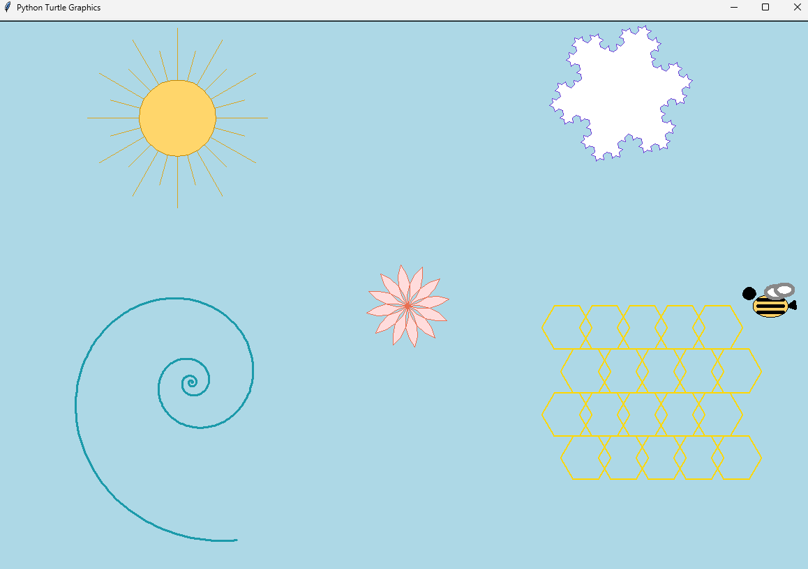

# Turtle Graphics Pack — Shaded Front Faces

A small collection of figures drawn with Python’s built-in `turtle` module.

**Figures:**
1. Double rhombuses (white fill, black contour only)
2. Triangle with inset (filled)
3. Isometric prism (front face shaded, back edges dashed)
4. Olympic rings (monochrome outline)
5. Compass rose (centered circle; labels in light purple)
6. Marked square (dashed edges, diagonals, dots)

## Preview

Add a screenshot as `preview.png` in this folder and it will render below:


# Turtle Graphics Pack — Shaded Front Faces & Extended Figures

A collection of figures drawn with Python’s built-in `turtle` module.  
This project demonstrates modular drawing functions, use of fills, and creative compositions.

---

## Figures

1. 🌞 **Sun** — yellow disk with alternating rays  
2. 🌀 **Spiral** — logarithmic spiral with thicker line  
3. 🐝 **Honeycomb + Bee** — gold hexagonal grid with a simple bee drawn from shapes  
4. ❄️ **Snowflake** — Koch fractal snowflake, now filled white with purple outline  
5. 🌸 **Flower** — arc-petal flower (petals only, no center circle)  

---

## Preview



---

## Run locally

```bash
git clone https://github.com/<your-username>/turtle-graphics-pack.git
cd turtle-graphics-pack
python turtle_new_figures.py

## Run locally

```bash
python turtle_shaded_figures.py
