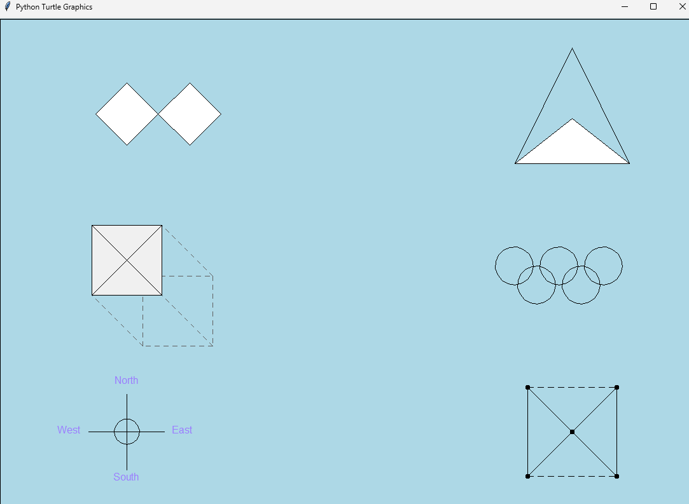

# Turtle Graphics Pack — Shaded Front Faces

A small collection of figures drawn with Python’s built-in `turtle` module.

**Figures:**
1. Double rhombuses (white fill, black contour only)
2. Triangle with inset (filled)
3. Isometric prism (front face shaded, back edges dashed)
4. Olympic rings (monochrome outline)
5. Compass rose (centered circle; labels in light purple)
6. Marked square (dashed edges, diagonals, dots)

## Preview

Add a screenshot as `preview.png` in this folder and it will render below:



## Run locally

```bash
python turtle_shaded_figures.py
